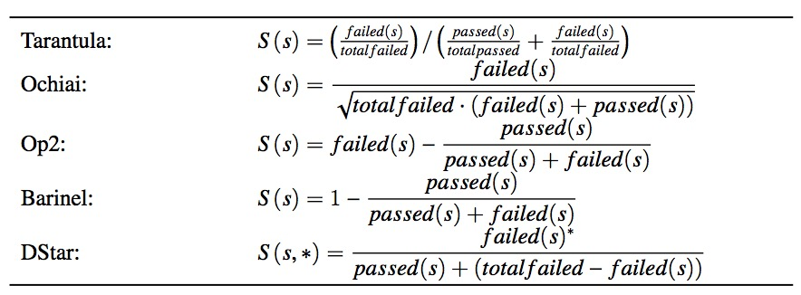

# 软件缺陷定位
MG1933100-罗雯波

## 1 背景
在今天，软件已经成为了我们生活中不可或缺的一部分。随着时代进步和技术的发展，这个趋势显得越来越不可阻挡，软件对我们生活的影响已经越来越全面和深刻。一方面，我们为技术进步带来美好生活感到欣喜；但是另一方面，我们也应该认识到技术是一把双刃剑，在使用它的时候我们必须要对其有全面深刻的认识和把握，不能让它脱离了控制。越来越大规模和数量的软件带来的不仅是更加便捷的生活，也带来了无数的风险，这些风险大多是由于软件存在缺陷所造成的。根据美国国家标准技术研究所在2002年的报告，软件缺陷每年对美国经济所造成的损失估计为595亿美元，是其GDP的0.6%，并且这个数字依然在增长。

程序缺陷的修复，要经历若干环节。首先需要对程序进行测试，以期可以判断软件中存在缺陷。判断出程序存在缺陷后，便要对程序缺陷进行定位和修复。其中程序缺陷的定位就是一个不可或缺却又很棘手的环节。从历史上看，定位程序缺陷通常是由人工完成的，这个过程既耗时又枯燥，且贵的离谱。随着软件程序的规模和复杂度都越来越难以控制，这项工作的难度可以预见到会越来越难以接受。并且，这个工作非常依赖于开发者个人的经验判断，而没有固定的操作流程，对每一个缺陷的定位都是一次全新的未知的挑战。

基于这样的背景，学界产生了研究自动化软件缺陷定位技术的兴趣，用于全自动或半自动地辅助开发者快速地对软件缺陷进行定位，以节省昂贵的人工资源。
## 2 问题定义
程序缺陷定位是程序缺陷修复的一个重要环节。通过测试技术，我们可以发现程序中存在缺陷，接着我们需要使用正确的补丁对程序进行修复。在这个过程中，一个非常重要的环节就是对程序缺陷的定位，只有首先定位了程序的缺陷，才能进一步对程序缺陷进行必要的理解，然后针对缺陷编写适当的补丁，并尝试进行程序的修复。传统上，缺陷定位这个过程通常由开发者来完成，具有一定的直觉依赖性。为了应对规模越来越庞大且复杂度越来越高的程序，多年来有多种高级的自动化程序缺陷定位技术也被提出和研究。 
为了方便共同研究，通常采用以下的统一的问题定义方式。

给定一个程序*P*，一个测试用例集合*TS*，集合中至少存在一个测试结果为不通过的测试用例*T*，即 status(T) = failed。自动化缺陷定位技术以*P*和*TS*为输入，输出一个有序的程序元素列表*E-list*，其中包含缺陷的程序元素排越靠前，则结果越好。在研究中，程序元素有不同的粒度，可以是文件、类、方法或语句。由于过大的粒度会导致定位结果在实际应用中帮助不大，一般选择的粒度是方法或语句。
关于程序缺陷具体在什么位置，通常由人工标注，具体方法是通过对比修复缺陷前后的程序版本，通过 diff 代码文件，并剔除无关的改动，得到缺陷具体的位置。

## 3 传统人工的定位技术
传统的程序缺陷定位主要依赖于开发者对程序内在逻辑的理解，与开发者的经验判断有很大的关系。为了应对复杂的程序逻辑，有多种技术在多年的软件工程实践中被总结和开发出来，辅助开发者对程序的内在逻辑和运行结果进行理解和分析，包括程序日志、断言、断点和剖析。
### 3.1 日志
程序日志由被插入程序中的许多语句（通常是 print 语句）产生，可以在运行时实时地监视并记录包括程序变量的值在内的许多程序状态信息。当发现了程序执行时异常的行为，开发者可以通过检查程序日志来诊断导致异常行为的原因，进而定位到程序缺陷的位置。程序日志可以帮助开发者理解和分析复杂的软件系统，更重要的是可以记录下运行时信息，对一些难以复现的异常行为，没有日志的记录几乎是不可能进行有效分析的。
### 3.2 断言
断言是在程序中植入的一些约束，它们在程序正确运行时的值应该为真。也即，如果在程序运行时发现断言条件的结果为假，那么此时的程序运行已经出现了异常，开发者可以让程序在断言条件为假的地方让程序中止并检查程序状态，尽早地发现引起异常的原因。
### 3.3 断点
断点用于让程序在执行到了特定的位置时暂停，让开发者可以检查当前的程序状态。在断点被触发后，开发者可以检查当前程序状态并且可以对其进行直接的修改，然后让程序继续运行。还可以设置数据断点，让程序某个表达式的值发生了改变时暂停。条件断点则仅在某个条件成立的时候触发，其他情况下就不中断程序的执行。有许多高级工具被开发出来帮助开发者对程序进行断点调试分析，著名的有 GNU GDB 和 Microsoft Visual Studio Debugger。
### 3.4 剖析
剖析是注重于对程序运行时的性能（如执行时间和内存占用量）的分析，通常是为了对程序进行优化所做的分析。但是对程序的剖析也是有利于对缺陷的分析的，例如检测到某些语句的不寻常的执行频率。能够对程序进行剖析并进一步调试的工具有 GNU 的gprof 以及 Eclipse 的插件 TPTP等。

## 4 自动化的定位技术
随着软件系统越来越复杂，传统的程序缺陷定位技术效率不高的缺陷日益显现出来。由于传统技术依赖于开发者的直觉来进行经验判断，过于庞大和复杂的软件系统会越来越难以理解和分析。因此，许多自动化的定位技术被提出并加以研究。这些新技术主要来源于因果关系这个观点，一种着力于刻画现象（在这里指程序执行错误）与原因（在这里指程序缺陷）之间关系的哲学理论。一些因果模型的例子有：基于反事实分析的、基于概率或统计的和因果微积分模型等。其中，在程序缺陷定位技术中基于概率的因果模型是最被广泛使用来识别造成执行错误的可疑代码的。

### 4.1 基于程序频谱的方法
程序频谱泛指程序执行的某些方面的信息，它可以是分支覆盖情况、方法 调用路径、语句覆盖情况等等。其中被研究工作使用较多的一种被称为可执行 语句命中谱，记录了每个测试用例执行过程中，哪一些可执行语句被覆盖的信息。著名的基于程序频谱的缺陷定位工作 Tarantula 使用可执行语句命中谱来计算语句的可疑度。另一些方法例如 Ochiai、Op2、Barinel 和 DStar 等也均使用了这种程序频谱作为可疑度计算的依据。

上图是Tarantula、Ochiai、Op2、Barinel 和 DStar 方法中所使用的可疑度 计算公式。其中 passed(s) 和 failed(s) 分别表示可执行语句 s 被成功和失败的测试用例覆盖的次数, totalpassed 和 totalfailed 代表成功和失败的测试用例数量，这些信息通过可执行语句命中谱和测试结果可以得到。基于可执行语句命中谱的技术思想大致相同:被失败的测试用例覆盖的语句更有可能是错误的;被通过的测试用例覆盖的语句更有可能是正确的。表中的公式都是这两条思想的不同反映。

### 4.2 基于程序突变的方法
基于突变的缺陷定位技术是受到突变分析的启发，通过在程序上进行一些称为突变的小改动，可以得到突变前后两组程序测试的结果和行为。通常这类方法通过分析这两者之间的差别来判断语句是否可疑。基于突变的缺陷定位技术重新设计了可疑度公式来避免基于程序频谱的技术存在的问题。基于突变的缺陷定位技术最典型的代表就是 MUSE 和 Metallaxis。为了避免语句执行模式相同的问题，这两个工作都使用语句上产生的程序变体的测试结果作为该语句的可疑度的依据。

其中，MUSE 的可疑度计算基于两个猜想:
1. 在错误的语句上进行突变比在正确的语句上进行突变更有可能使得原来就 失败的测试用例变为通过。
2. 在正确的语句上进行突变比在错误的语句上进行突变更有可能使得原来正 确的测试用例变为失败。

MUSE 的语句可疑度通过计算 M(m) = failed(m) − f2p/p2f 与 S(s) = avg(M(m)) 得到，其中 m 代表一个程序变体，failed(m) 是在这个程序 变体上测试用例从失败变为通过的数量，而 f2p 是所有程序变体上从失败变为 通过的测试用例的数量，passed(m) 和 p2f 的定义是类似的，而 mut(s) 是指在 语句 s 进行突变能够产生的程序变体的集合。

类似的，Metallaxis 也基于程序变体测试的两个行为假设:
1. 在同一组语句上附加突变错误，程序的行为通常是相似的。这也意味着在错误的语句上进行突变，那测试的行为或结果应该是相似的。
2. 在不同的语句上附加突变错误，程序则显现出不同的行为。与上面相反，在正确的语句上进行突变，测试的行为应该是不同的。

Metallaxis 借鉴 Ochiai 的公式来度量这个相似程度，并设计可疑度为 S(s) = max(M(m))，而 M(m) = failed(m)/(totalfailed(failed(m) + passed(m)))^0.5 其中 failed(m) 定义为在程序变体 m 中原来失败的测试用例行为发生改变
的数量 (例如，变为通过或是失败原因不同)，passed(m) 的定义也类似， totalfailed 同样也是原程序失败测试用例的数量。

基于突变的方法利用变异测试，极大的拓展了原有的测试用例，同时也为缺陷定位提供了一个新的思路，在一些数据集上获得了相当不错的结果。但同时，在他们设计的可疑度公式中，语句的可疑度仅仅依赖于在该语句上能够产生的变体以及程序变体上的测试结果。因此，这两种基于突变的缺陷定位技术 虽然能够避免类似基于程序频谱的技术所存在的基本块中的语句共享可疑度的问题，却不能为无法进行突变的语句计算可疑度。

## 5 研究趋势
传统的自动化缺陷定位方法仍然存在性能提升空间，随着机器学习技术的发展，学界开始在缺陷定位领域引入机器学习技术。借助深度学习的强大学习能力，新技术能够自动综合在程序分析阶段收集的大量信息，并进行缺陷位置的预测。
