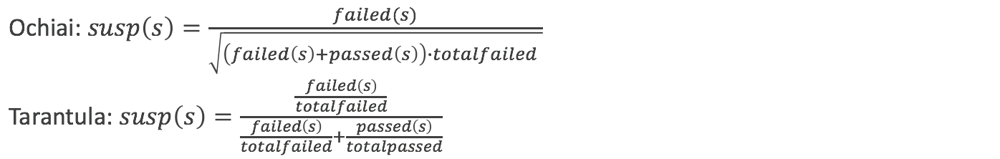
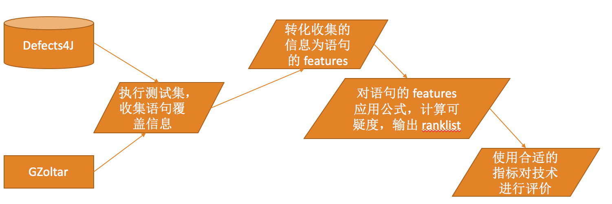
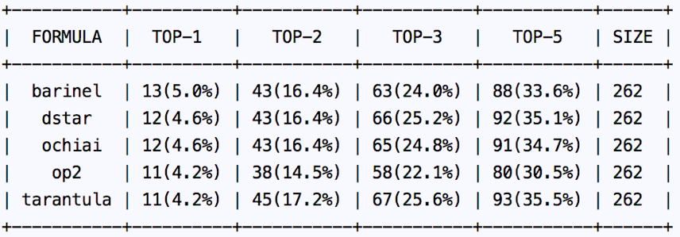
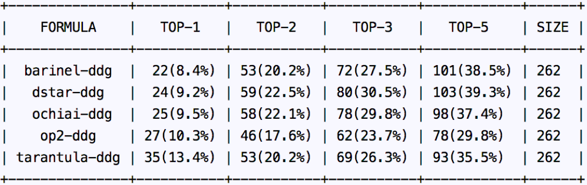

# 自动化程序缺陷定位
- 《软件维护与演化导论》课程实验报告
- 罗雯波，卫昱阳，陈佳一，许端琛

## 1 项目选题
题目：基于程序分析的自动化缺陷定位技术

问题来源：在软件开发过程中，不可避免地会出现 bug，即软件缺陷，要修复软件缺陷，就必须首先找到缺陷的位置。在一般的 debug 过程中，缺陷定位通常依靠开发者对软件行为的理解，这非常依赖于开发者的个人能力和灵感。为了帮助开发者快速地对软件缺陷进行定位，学界开始研究自动化软件缺陷定位技术。

## 2 问题定义
输入：一个程序 P，测试用例集 TS，且 ∃𝑇 ∈ 𝑇𝑆, 𝑠𝑡𝑎𝑡𝑢𝑠(𝑇)=𝑓𝑎𝑖𝑙𝑒𝑑，即至少存在一个测试不通过。

输出：排好序的程序元素列表 E-list，其中包含缺陷的程序元素排越靠前，则结果越好。

在研究中，程序元素有不同的粒度，可以是文件、类、方法或语句。由于过大的粒度会导致定位结果在实际应用中帮助不大，一般选择的粒度是方法或语句。

关于程序缺陷具体在什么位置，通常由人工标注，具体方法是通过对比修复缺陷前后的程序版本，通过 diff 代码文件，并剔除无关的改动，得到缺陷具体的位置。

## 3 研究背景
传统方法主要基于程序覆盖信息：
通过执行测试用例，可以获得每个测试用例对程序语句的覆盖信息
对程序中每一个语句 s，可以记录它分别被 failed 的测试用例和 passed 的测试用例覆盖的次数，表示为 failed(s) 和 passed(s)，并用 totalfailed 和 totalpassed 分别表示总的 failed 和 passed 的测试用例的个数，基于这些信息，可以设计公式来计算每条语句的可疑度 susp(s)。
根据可疑度，对所有程序语句进行排序，可疑度越高的排越前。

传统的定位方法的可疑度计算公式有：

## 4 研究思路
传统的基于程序覆盖信息的定位方法对程序信息的利用较少，存在缺陷：
1. 无法区分同一个语句块中的语句，因为同一个语句块中的语句在一次运行中要么一起被执行，要么都没有被执行，这就导致最终在计算可疑度时是被同等看待的，在排序时必然导致并列。
1. 由于语句之间的依赖关系，在一次 failed 的测试用例的执行过程中，被依赖语句的执行会导致依赖于这条语句的其它语句也被执行，这种情况下，被依赖语句更可能是错误语句，而不是同等看待。

基于以上考虑，我们设想通过加入依赖信息来改进传统的基于程序覆盖信息的定位方法：
1. 使用分析工具，分析语句的依赖关系
1. 使用传统的基于覆盖信息的可疑度计算公式计算语句可疑度
1. 根据语句的依赖关系，进一步调整语句的可疑度，得到最终的语句可疑度
1. 根据最终的可疑度对语句进行排序

## 5 研究计划
在设计出新的方法后，为了验证有效性，我们需要实现我们的方法，并进行实验：
- 考虑实验方便性，我们计划针对 Java 程序的缺陷定位进行具体实现
- 选取现有的 Java 缺陷程序数据集如 Defects4j 进行实验

研究问题：
- RQ1：现有的基于频谱的定位方法之间的效果对比；
- RQ2：现有的基于频谱的方法在不同 bug 实例上的效果对比；
- RQ3：我们提出的新方法的效果与基于频谱的方法的对比；

## 6 实验
### 6.1 实验对象
我们的选择了当前比较流行的 Java 缺陷数据集 Defects4J 中的 262 个 bug，这些 bug 来自 5 个流行的开源项目，实验基本达到一定的规模。

|项目 ID|项目名称|bug 数量|
|---|---|---|
|Chart|jfreechart|26|
|Lang|commons-lang|65|
|Math|commons-math|106|
|Mockito|mockito|38|
|Time|joda-time|27|
|Total|/|262|

### 6.2 实验设计
我们已经了一个完整的实验框架，主要基于 Python 脚本。

#### 6.2.1 基于频谱的缺陷定位
为了进行基于频谱的缺陷定位，我们需要收集程序运行时的语句覆盖信息。在这里，我们使用了 GZoltar 这个工具来进行信息收集。
GZoltar 执行程序的 JUnit 测试集，收集测试的结果，并且记录每一个测试的语句覆盖信息，使用一个矩阵来描述。矩阵的每一行对应一个测试，每一列对应一条语句，矩阵每一个元素为 0 或 1，0 表示未覆盖，1 表示已覆盖。

有了收集的数据后，我们使用 Python 脚本实现了缺陷定位技术以及对其结果的评价。
1. 读取 GZoltar 收集的数据，抽取出缺陷定位需要的对应每条语句的 passed，failed，totalpassed和 totalfailed 数据。
1. 实现不同缺陷定位技术所使用的可疑度公式，对每一个缺陷实例，计算所有语句的可疑度，并对语句根据可疑度进行排序，输出 ranklist，即定位的结果。
1. 实现合适的评价指标，以 ranklist 为输入，对不同技术的定位结果进行定量的评价，作为技术优劣的对比。

#### 6.2.2 使用依赖信息进行增强
我们基于 Soot 框架，使用流分析技术，分析数据依赖与控制依赖信息。
具体地，我们抽取的数据依赖信息是 def-use 依赖，即语句 t 读取了某个由语句 s 定义（写入）的变量，则称语句 t 数据依赖与语句 s。
对每个语句，可以获取其 def 和 use 的变量集合，并记录下来。若 def 了一个已经被 def 过的变量，则会覆盖掉。
Soot 框架会沿着控制流进行迭代分析，不断更新 IN 和 OUT的集合， 直到达到不动点。
在迭代的过程中，可以记录下每一个 def-use 对，这样的 pair 就形成了数据依赖。

接下来使用依赖信息来增强定位结果。
对于基于覆盖信息的定位结果，每一条语句 s 都对应一个可疑度分数 score(s)，由抽取的数据依赖信息中可以获得依赖于语句 s 的语句集合 depend(s)。
根据我们的假设，依赖于语句 s 的语句可能会因为语句 s 的错误导致出错，进而“无辜”地增加了可疑度，因此语句 s 的可疑度应该相应地增大。
首先设置一个系数参数 a，将语句 s 的可疑度分数更新为: 

在实验中，我们设置 a = 0.4

### 6.3 实验结果
#### 6.3.1 基于频谱的缺陷定位方法
基于频谱的缺陷定位方法结果如下

**RQ1：根据表格可以看出，不同公式的定位方法的效果差别不大。**

**RQ2：统计发现，5 个技术所排到 TOP-1 的实例总集仅有 14 个，意味着大部分是重复的。**

这样的结果说明基于相同信息的方法的结果是相似且重复的，没有互补，要增强结果，使用新的信息是更好的方向。

#### 6.3.2 使用依赖信息增强的定位方法

增强后的定位方法结果如下，FORMULA 列中的 –ddg 表示使用了 data dependency graph 来增强：

可以看出，增强的效果非常明显，在 TOP-N 上都有了显著的提升，在 TOP-1 这个重要指标上有至少 70% 的提升。其中 tarantula 公式 有 218% 的提升。

**RQ3：实验结果充分显示了我们方法的有效性。**

## 总结
在本次实验中，我们调研了现有的基于频谱的缺陷定位技术，并实现了实验脚本，复现了相关实验。在此基础之上，我们设计了改进方案并进行实验。实验结果显示我们的方案对现有技术有较大的提升。

